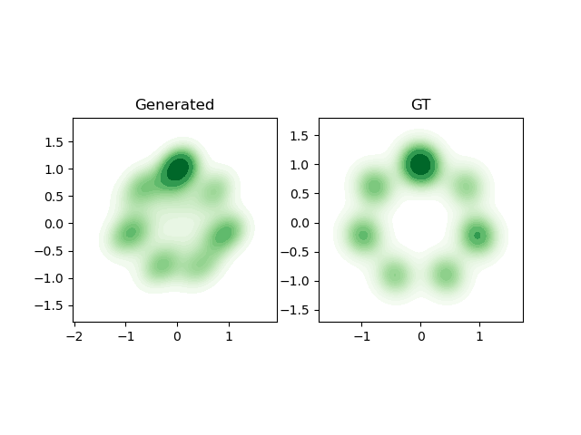
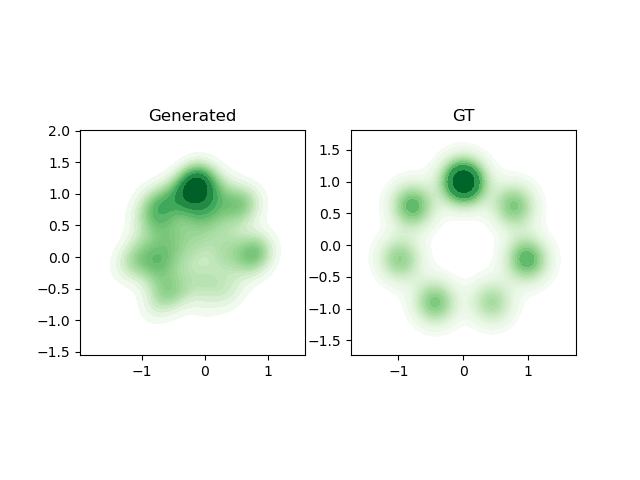
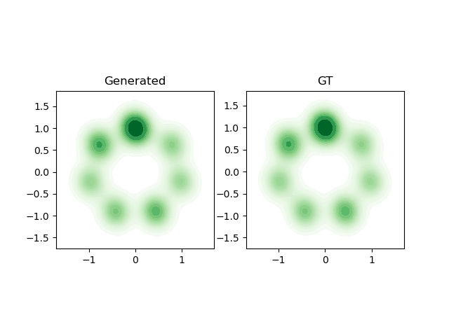
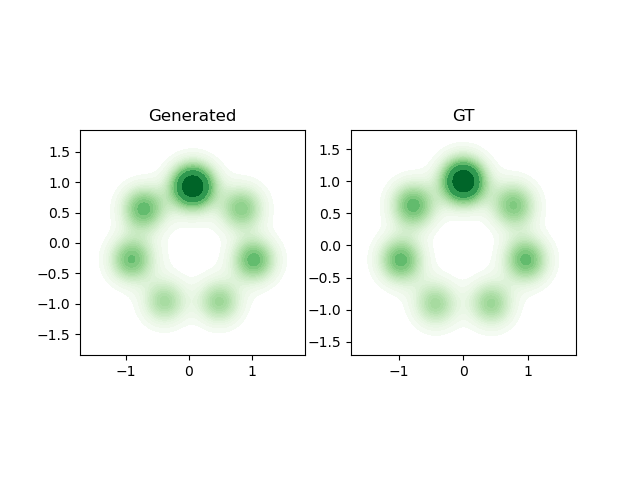
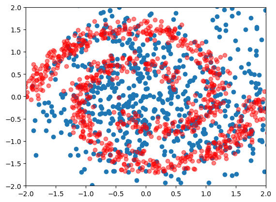
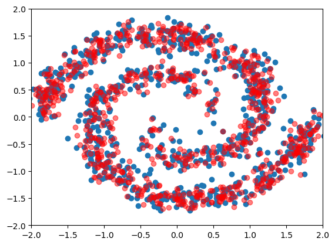
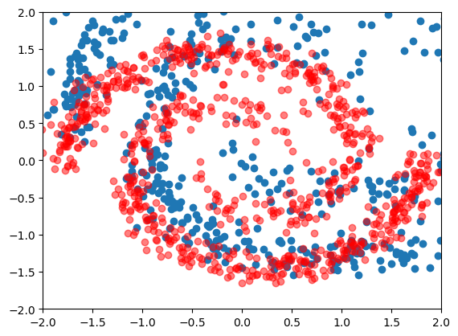

# Goal
A repository of making toy datasets for more generative models to be validated. Including a baseline model of 2-layered linear network(2x256, leakyReLU, 256x2, Tanh).

## make dataset
[Toy discrete distributions](./_create_dataset/img2dist.py)
* target dataset of scatter 1D distribution of image    
* Some spiral dataset  

[Dataset from torch](https://pytorch.org/docs/stable/distributions.html)
* original dataset of 1D multivariate Gaussian  
  
    
## model
### Autoencoder
1. 2k iterations
 - model of linear layers (2->16->64->128->256->512, 512->256->128->64->2)  

 - smaller network(2->128->128->256->128->128->2)  

2. 20k iterations

 - Neural ODE
### GAN 
 - with same level of parameterization?

## Technical problems
1. Should the input tensor require grad? Otherwise it does not update?
    * depends whether the inputs are expected to be updated(e.g. score-matching function that updates the diffusion tensors)
2. Is KL divergence better than MSE?
    * KL divergence easily faces vanishing gradient(remember to put inputs in log space)  
    

    * MSE tends to move to convergence, but very slow  
    

    * Mixing the above two  
    
3. Additional force to push two distribution to overlap?
    * It's observed from applying negative log-likelihood(NLL) and KL divergence seperatedly, that only applying NLL to measure the reconstruction loss tends to generate more fuzzy distribution than KL, which forces the details of the distribution to match.

4. Autoencoder seems already work better than a GAN, given same level of parameterization?
